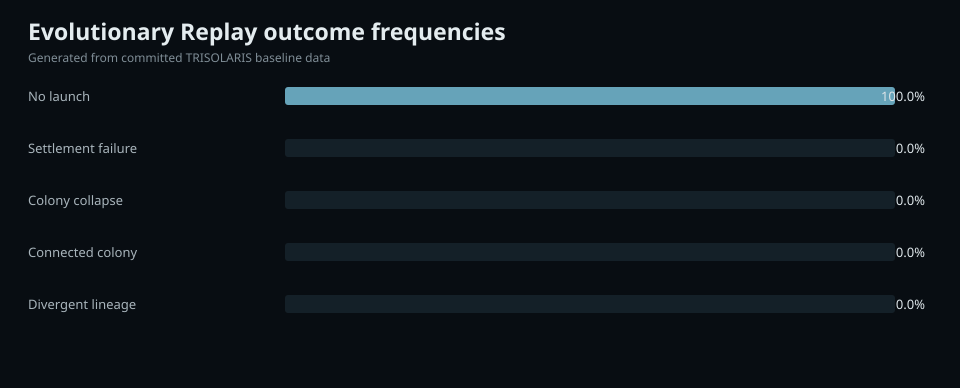
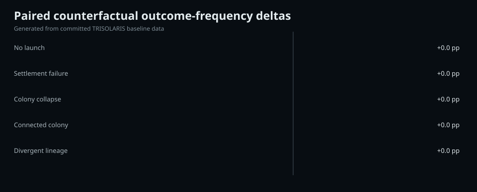

# Robustness of a modeled multiplanetary transition in the TRISOLARIS LTT 1445 scenario

## Abstract

We evaluated whether the baseline TRISOLARIS multiplanetary trajectory is robust to declared scenario uncertainty. A seeded Evolutionary Replay ensemble of 64 runs was propagated through settlement, colony-network and off-world divergence layers. The dominant modeled outcome was no-launch in 100.0% of runs. A paired same-seed counterfactual changing capability by +20% changed outcome class in 0.0% of paired histories. These frequencies are conditional on the declared model and perturbation envelope and are not real-world probabilities.

## Research question

Are modeled multiplanetary outcomes robust to declared uncertainty, and which single interventions alter the simulated historical trajectory?

## Hypothesis

The baseline outcome is treated as robust within the declared model envelope when one outcome class dominates the replay ensemble and modest paired interventions do not frequently change run-level outcome classes.

This is a hypothesis about simulator behavior, not about the real LTT 1445 system or real human futures.

## Background

TRISOLARIS combines observed system data, literature parameters and an explicitly speculative world, H-01, in a causal modeling chain. Observed planets are imported from the NASA Exoplanet Archive. H-01 remains a scenario object and is never promoted to an observed planet.

## Data and epistemic scope

- Observed planet rows: 2
- Experimental world: H-01 — SPECULATIVE
- Release: REL-TRISOLARIS-0001
- Git commit: 58a6a8cdeb661d8277b3830e57a0b740dce82cb5
- Evidence items: 16

## Methods

### Model stack

- latitudinal_ebm_v0.1 — frontend/data/climate-baseline.json
- surface_systems_v0.1 — frontend/data/surface-baseline.json
- ecological_guild_support_v0.1 — frontend/data/foodweb-baseline.json
- human_settlement_support_v0.1 — frontend/data/settlement-baseline.json
- population_lineage_divergence_v0.1 — frontend/data/lineage-baseline.json
- population_genetics_v0.1 — frontend/data/popgen-baseline.json
- time_dependent_demography_v0.1 — frontend/data/demography-baseline.json
- functional_astroanthropology_v0.1 — frontend/data/astroanthropology-baseline.json
- interplanetary_settlement_v0.1 — frontend/data/interplanetary-baseline.json
- interplanetary_network_v0.1 — frontend/data/interplanetary-network-baseline.json
- offworld_divergence_v0.1 — frontend/data/offworld-divergence-baseline.json
- evolutionary_replay_v0.1 — frontend/data/evolutionary-replay-baseline.json
- counterfactual_replay_v0.1 — frontend/data/counterfactual-replay-baseline.json

### Evolutionary Replay

The baseline replay used 64 runs, random seed 1445, an uncertainty envelope of 25.0%, founder size 500, exchange strength 0.3, resupply strength 0.35 and infrastructure shock 0.0.

### Paired counterfactual

The counterfactual uses the same random seed and pairs each reference run with the corresponding intervention run. The baseline intervention changes capability by +20%.

## Results

### Replay ensemble

The dominant modeled outcome was **No launch**, occurring in **100.0%** of 64 replay runs.

Exact values are in tables/outcome-frequencies.tsv.

### Counterfactual intervention

The paired intervention changed outcome class in **0.0%** of runs. Mean outcome-score delta was +0.000; mean divergence-proxy delta was +0.000000.

Exact values are in tables/counterfactual-deltas.tsv.

## Sensitivity and interpretation

A dominant replay frequency indicates robustness only within this model and perturbation envelope. A small counterfactual response does not establish real-world insensitivity; it shows that the current simulator did not cross its modeled thresholds under the declared intervention.

## Claim-to-evidence map

- CLM-0001 -> EV-MOD-0012: ensemble frequency is model-conditional and is not a real-world probability
- CLM-0002 -> EV-MOD-0013: paired differences are causal only within the declared model intervention

## Limitations

- RESEARCH_NOTE readiness is an internal reproducibility gate, not peer review
- the release does not claim ARXIV_READY status
- model outputs inherit the limitations of every upstream model in the causal chain
- deep-time outcomes remain scenario-dependent and are not forecasts
- human review is required before any external scientific submission

Selected upstream limitations:

- climate: annual-mean latitude-only model
- surface: assumes an Earth-mass/radius reference world for atmospheric-retention screening
- foodweb: does not model abiogenesis
- settlement: generic population model; no individual medical prediction
- lineage: abstract physiological trait indices, not a genomic simulation
- population_genetics: four abstract biallelic loci only
- demography: normalized population indices, not census forecasts
- astroanthropology: functional strategy proxies, not predictions of real cultures
- interplanetary: transfer time uses an idealized coplanar circular Hohmann half-period and excludes escape/capture maneuvers
- interplanetary_network: population dynamics are reduced-order demographic proxies, not forecasts
- offworld_divergence: divergence is a reduced-order proxy and not a genomic simulation
- evolutionary_replay: ensemble frequencies are conditional on declared perturbation ranges and are not real-world probabilities
- counterfactual_replay: the comparison isolates one declared model parameter while holding the replay seed fixed

## Discussion

The baseline result remains useful when negative. If all or nearly all runs remain in the same pre-expansion state, the current model is indicating that the baseline population is not merely fluctuating around a multiplanetary threshold. This motivates threshold-search experiments rather than a stronger real-world claim.

## Conclusions

The current baseline is reproducible and internally traceable. Its ensemble and counterfactual results support a narrow claim about the current TRISOLARIS model only. They do not establish real-world probability, feasibility or inevitability.

## Reproducibility

- Release: REL-TRISOLARIS-0001
- Experiment: EXP-TRISOLARIS-0001
- Git commit: 58a6a8cdeb661d8277b3830e57a0b740dce82cb5
- Evolutionary Replay seed: 1445
- Counterfactual seed: 1445
- Exact tables: tables/
- Generated figures: figures/
- Evidence ledger: evidence.json
- Experiment parameters: experiments.json

See REPRODUCE.md.

## Data availability

All data used by this note are versioned in the TRISOLARIS repository and enumerated in metadata.json and experiments.json.

## Code availability

The analysis code is versioned at commit 58a6a8cdeb661d8277b3830e57a0b740dce82cb5.

## Publication status

RESEARCH_NOTE. This package is not peer reviewed and is not automatically ARXIV_READY, SUBMITTED or PUBLISHED.

## References

See references.bib.
